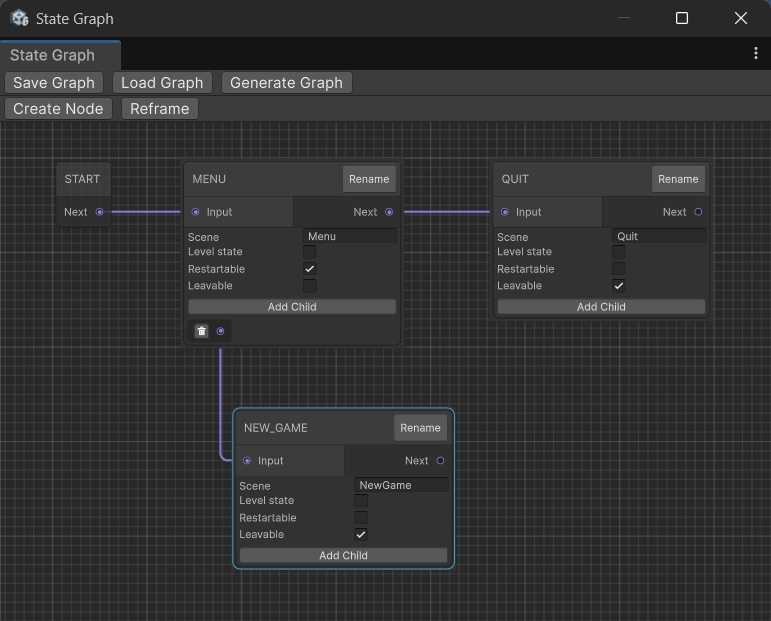
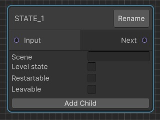
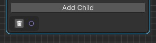
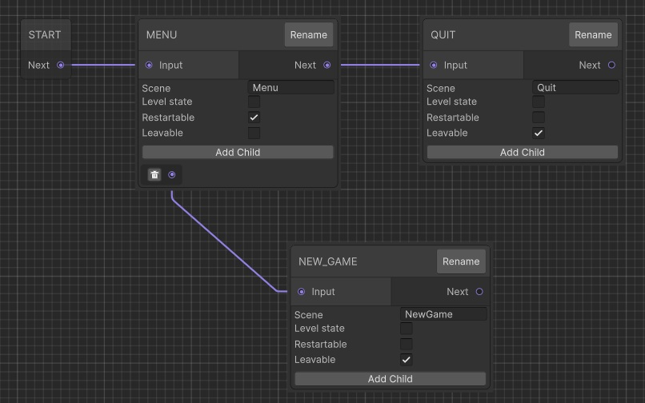
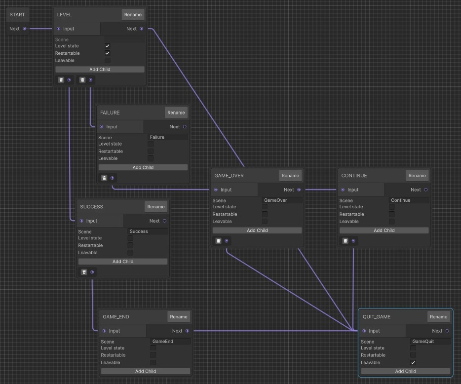

# State Engine Graphview

Tool to create state graphs for the [**Unity State engine**](https://github.com/2-REC/unity-state-engine) project directly from within the Unity Editor.



More information about the graphs and how they are used can be found in that repository's documentation.

[**Graphs**](#graphs) are composed of [**States**](#states) properties and [**Transitions**](#transitions).


## Graphs

A *State Engine* project generally has 2 graphs:
* Global: Main menu, intro, etc.
* Game: Levels, map, etc.

The graphs are defined by XML files, which can be generated using this tool.


## States

A state is defined by a set of properties:
* `id`: State name.\
	Serves as unique identifier.
* `scene`: Name of the Unity scene associated to the state.\
	This field is mandatory unless the state is a *level state* (see `isLevel`).
* `isLevel`: Specifies if the state is a *level state*, related to game levels.\
	This field is optional (default: false).
* `restartable`: Specifies if the state can be executed again when coming back from its childen states.\
	This field is optional (default: false).
* `leavable`: Specifies if the graph can be left from this scene.\
	This field is optional (default: false).
* `next`: Next state (see [**Transitions**](#transitions)).
	This field is optional. If not set, the control is given back to the parent state once the state has finished its execution.
* `children`: List of children states (see [**Transitions**](#transitions)).\
	The list can be empty.


## Transitions

* Children:
	* Defined in a state through its `children` property.
	* When expecting to get back from child state when done (state must be `restartable`).
	* State cannot be its own parent/child (even indirectly).
	* Transition made in the state engine by calling `LoadChildState(STATE_NAME)`.

* Next:
	* Defined in a state through its `next` property.
	* For obvious/logical transition to next state.
	* If more than 1 state is needed, the `children` property can be used instead, in which case the state should not be `restartable` to keep a similar behavior.
	* Transition made in the state engine by calling `End()`.\
		If no next state is specified, the current state is popped from the stack until a `restartable` parent state is found.

* Leave:
	* Defined in a state through its `leavable` property.
	* To allow to exit the current graph from the state and switch to another scene (typically in another graph).
	* Transition made in the state engine by calling `Leave()`.\
		If no scene name is provided, the application is terminated.

## Setup

Copy the `StateGraph` folder in the Unity's project `Assets` folder or any of its subfolders.

The tool is then available in the editor through the "*State Graph*" entry of the "*Graph*" menu.


## Usage

Toolbars are present at the top of the tool's user interface, containing a set of buttons:
* *Save Graph*: Save the graph to an Unity *asset* file (`.asset`).
* *Load Graph*: Load the graph from an Unity *asset* file (`.asset`).
* *Generate Graph*: Export the graph to an XML file, usable by the *State Engine* project.
* *Create Node*: Create a new default [**node**](#node).
* *Reframe*: Center and adjust the zoom level to have the whole graph visible within the viewport.

In the viewport, common interactions are available:
* Pan and zoom view using the middle mouse button.
* Select and move node using the left mouse button.
* *Cut*, *Copy*, *Paste* and *Duplicate* operations via the right-click contextual menu.
* *Disconnect All* operation also available via the contextual menu.
* Delete node using the DELETE key.


### Node

A new node can be created using the "*Create Node*" button.

A new default node looks as follow:



The different properties of a state can be edited the node's interface.
* `Name`: The state `id`.\
	The value can be modified by using the "*Rename*" button.
* `Input`: Receiving end of a transition.\
	Corresponds to the destination of a transition from another state.
* `Next`: Emitting end of a transtion.\
	Corresponds to the source of a `next` transition to another state.
* `Scene`: The name of the scene associated to the state.\
	Several states can share the same scene if desired.
	> **NOTE:** Generally scenes might not exist yet at this point, making it difficult to complete the field. Generic names should be used, and eventually modified later in the XML file directly.
* `Level State`: Indicates that the state is a *level state*.\
	When the checkbox is ticked, the `Scene` property is disabled, as a *level state* doesn't have its own scene.
* `Restartable`: Indicates that the state is restarted when coming back from  child transition.
* `Leavable`: Indicates that the graph can be left from this state.
* `Children`: List of children states.\
	A new transition is added using the "*Add Child*" button, creating a new port in the node:
	\
	A new transition can be created from this port to the `Input` port of another node.\
	The port can also be deleted if unused.

See [state's description](#states) for information about each property.


## Example

The following graphs are coming from the *State Engine* project's ["Graphs"](https://github.com/2-REC/unity-state-engine/tree/master/Assets/Samples/Graphs) sample.

They have been generated using the tool.


### Global Graph

Example of a global graph:

and the generated XML:
```xml
<graph>
  <states>
    <state id="MENU" scene="Menu" restartable="true" next="QUIT">
      <children>
        <child id="NEW_GAME" />
      </children>
    </state>
    <state id="NEW_GAME" scene="NewGame" leavable="true" />
    <state id="QUIT" scene="Quit" leavable="true" />
  </states>
</graph>
```

### Game Graph

Example of a game graph:

and the generated XML:
```xml
<graph>
  <states>
    <state id="LEVEL" isLevel="true" restartable="true" next="QUIT_GAME">
      <children>
        <child id="SUCCESS" />
        <child id="FAILURE" />
      </children>
    </state>
    <state id="SUCCESS" scene="Success">
      <children>
        <child id="GAME_END" />
      </children>
    </state>
    <state id="CONTINUE" scene="Continue">
      <children>
        <child id="QUIT_GAME" />
      </children>
    </state>
    <state id="GAME_END" scene="GameEnd" next="QUIT_GAME" />
    <state id="GAME_OVER" scene="GameOver" next="CONTINUE">
      <children>
        <child id="QUIT_GAME" />
      </children>
    </state>
    <state id="FAILURE" scene="Failure">
      <children>
        <child id="GAME_OVER" />
      </children>
    </state>
    <state id="QUIT_GAME" scene="GameQuit" leavable="true" />
  </states>
</graph>
```

## Acknowledgements

The project uses the [*Unity Graphview API*](https://docs.unity3d.com/6000.2/Documentation/ScriptReference/Experimental.GraphView.GraphView.html).

Help on using the API was found in the *Youtube*'s ["*UNITY DIALOGUE GRAPH TUTORIAL*"](https://www.youtube.com/watch?v=7KHGH0fPL84) series by [Mert Kirimgeri](https://www.youtube.com/@MertKirimgeriGameDev).
